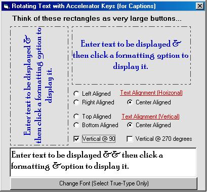



## LaVolpe Caption Rotator

### Description

Rotating captions are hard but doable. Keeping track of an accelerator key is complicated. This example has portable routines to rotate captions at 90 or 270 degrees & properly display the underscore on the hot key. In addition, you dictate where text is displayed by passing the bounding parameters. This will be used for a soon-2b-released vertical version of my buttons, so if you see errors, please let me know. Thanx.
 
### More Info
 
Read preface comments in project

             |
---                |---
**Submitted On**   |2004-02-28 14:12:22
**By**             |[LaVolpe](https://github.com/Planet-Source-Code/PSCIndex/blob/master/ByAuthor/lavolpe.md)
**Level**          |Advanced
**User Rating**    |5.0 (40 globes from 8 users)
**Compatibility**  |VB 6\.0
**Category**       |[Graphics](https://github.com/Planet-Source-Code/PSCIndex/blob/master/ByCategory/graphics__1-46.md)
**World**          |[Visual Basic](https://github.com/Planet-Source-Code/PSCIndex/blob/master/ByWorld/visual-basic.md)
**Archive File**   |[LaVolpe\_Ca1714272282004\.zip](https://github.com/Planet-Source-Code/lavolpe-lavolpe-caption-rotator__1-52051/archive/master.zip)

### API Declarations

Recangle APIs, DrawText & a couple Font APIs

